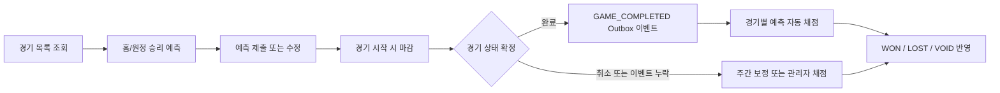
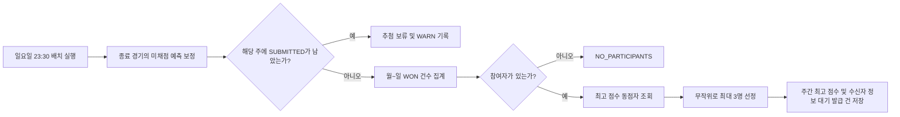
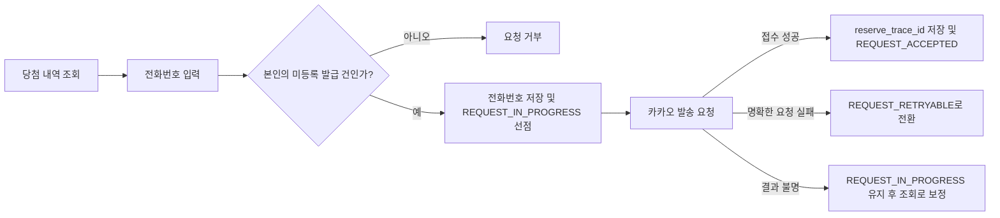

# 승부 예측 & 주간 보상 시스템

사용자가 경기 시작 전에 승패를 예측하고, 경기가 끝난 뒤 그 결과에 따라 주간 점수를 받는 참여형 이벤트 기능입니다.

매주 가장 높은 점수를 기록한 참가자 중 최대 3명을 추첨해 치킨 기프티콘을 드리며, 이런 방식으로 꾸준한 참여와 경쟁을 이끌어낼 수 있습니다.

---

## 1. 배경

지금까지 야구보구는 경기 정보 확인, 현장 관람 기록, 리뷰 작성 등 경기 이후의 경험 위주로 서비스를 운영해왔습니다.

이제 승부 예측 기능을 도입해, 사용자가 경기 시작 전부터 적극적으로 참여할 수 있도록 하고, 경기 종료 후에는 자신이 한 예측의 결과와 주간 순위를 다시 확인하러 방문하도록 만드는 것이 목표입니다.

주간 보상 시스템은 한 번 운 좋게 맞히는 것에 그치지 않고, 일주일 내내 예측에 계속 참여할 수 있는 동기를 제공합니다.

---

## 2. 목표

- 사용자는 경기 시작 전에 홈팀 또는 원정팀의 승리 중 하나를 예측할 수 있습니다.
- 경기가 끝나거나 취소된 뒤 예측 결과는 자동으로 채점됩니다.
- 맞힌 예측의 개수를 월요일부터 일요일까지 합산해 주간 점수로 집계합니다.
- 매주 최고 점수를 달성한 참가자 중 최대 3명을 추첨해, 보상 대상자로 선정합니다.
- 자동 채점이나 정기 추첨이 누락돼도 운영자가 직접 복구할 수 있도록 설계합니다.
- 같은 경기의 중복 예측, 같은 주차 내 중복 추첨을 막아 불필요한 혼선을 방지합니다.

---

## 3. 용어와 상태

### 3.1 예측 상태

| 상태 | 의미 |
| ---- | ---- |
| `SUBMITTED` | 제출되었지만 아직 채점되지 않은 예측 |
| `WON` | 예측 적중 |
| `LOST` | 예측 실패 |
| `VOID` | 무효로 처리된 예측 (무승부나 경기 취소 등) |

### 3.2 주간 추첨 결과

| 결과 | 의미 |
| ------------- | ----------------------------------------------------------- |
| `DRAWN` | 이번 주 당첨 결과가 새로 확정됨 |
| `ALREADY_DRAWN` | 이미 해당 주의 추첨이 완료됨 |
| `UNGRADED_PREDICTIONS_EXIST` | 아직 채점되지 않은 예측이 남아 있어서 추첨을 진행하지 않음 |
| `NO_PARTICIPANTS` | 적중한 예측이 없어 추첨 대상자가 없음 |

### 3.3 기프티콘 발급 상태

| 상태 | 의미 | 현재 동작 |
| --------------------- | -------------------------------------- | -------------------------- |
| `AWAITING_RECIPIENT_INFO` | 당첨자이지만 수신자 전화번호가 아직 입력되지 않음 | 추첨 시 생성됨 |
| `REQUEST_RETRYABLE` | 전화번호가 저장되어 발급 요청을 다시 시도할 수 있음 | 명확한 요청 실패 시 전환 |
| `REQUEST_IN_PROGRESS` | 발급 요청을 선점했거나 접수 결과 확인이 필요함 | 전화번호 저장과 함께 전환 |
| `REQUEST_ACCEPTED` | 카카오가 외부 발급 요청을 접수함 | 카카오에서 접수 신호를 받으면 전환 |
| `DELIVERED` | 기프티콘 전달 완료 | 상태만 미리 정의함 |
| `FAILED` | 발급 실패 | 상태만 미리 정의함 |
| `CANCELED` | 지급 취소 | 상태만 미리 정의함 |

> 카카오 발송의 실제 발송 결과는 조회 기능을 통해 확정하게 됩니다.

---
## 4. 사용자 및 시스템 흐름

### 4.1 예측 제출과 채점



사용자는 경기 목록에서 원하는 경기를 선택해 홈 승리 또는 원정 승리를 예측할 수 있습니다. 예측을 제출하거나 수정할 수 있는데, 경기가 시작되면 예측은 마감됩니다. 경기가 끝나고 결과가 확정되면, 완료된 경기는 이벤트로 저장됩니다. 이후 자동으로 예측 결과가 채점되고, 만약 경기가 취소되거나 이벤트 누락이 발생했다면 주간 보정이나 관리자가 직접 채점을 진행합니다. 마지막으로, 예측 결과는 ‘성공’, ‘실패’, ‘무효’로 반영됩니다.

### 4.2 주간 보상 추첨



매주 일요일 밤 11시 30분에 전체 프로세스가 실행됩니다. 먼저, 한 주 동안 종료된 경기 중 채점되지 않은 예측들을 보정합니다. 만약 해당 주에 제출된 예측이 남아 있다면, 추첨을 잠시 미루고 경고(WARN)를 남깁니다. 그렇지 않으면 월요일부터 일요일까지 성공한 예측의 건수를 집계해 참여자가 있는지 확인합니다. 참여자가 없다면 그 주는 추첨이 진행되지 않지만, 만약 있다면 최고 점수를 받은 동점자를 뽑아 이들 중 무작위로 최대 3명을 선정합니다. 이렇게 선정된 인원의 정보는 주간 최고 점수와 함께 대기 발급 건으로 저장됩니다.

### 4.3 당첨자 전화번호 등록과 발송 요청



당첨자는 본인의 당첨 기록을 확인한 뒤 휴대폰 번호를 입력할 수 있습니다. 수신자 정보 대기 또는 요청 재시도 가능 상태에서만 번호를 입력할 수 있으며, 전화번호 저장과 발급 요청 선점은 하나의 트랜잭션으로 처리됩니다. 카카오가 요청을 접수하면 관련 정보를 저장하고 `REQUEST_ACCEPTED`로 전환합니다. 요청 실패가 명확하면 `REQUEST_RETRYABLE`로 전환하고, 결과를 확인할 수 없으면 `REQUEST_IN_PROGRESS`를 유지한 뒤 조회로 보정합니다.

---
## 5. 기능 요구사항과 구현

### 5.1 예측 제출

- 예측은 홈팀 승리, 또는 원정팀 승리 중에서 선택할 수 있습니다.
- 한 사용자는 같은 경기에 대해 한 번만 예측할 수 있습니다.
    - 애플리케이션에서 이미 예측한 내역을 먼저 확인합니다.
    - 마지막 방어선으로 `(member_id, game_id)`에 유니크 제약을 둡니다.
    - 만약 동시에 같은 예측이 중복 제출되어 무결성 예외가 발생하면, 이를 409 Conflict 오류로 응답합니다.
- 경기가 시작하기 전까지만 예측을 제출하거나 수정할 수 있습니다.
    - 서버에 등록된 `Clock` 기준으로 경기 일자와 시작 시각을 비교해 마감 여부를 판단합니다.
    - 마감 이후에는 예측 제출이나 수정 요청이 오면 422 Unprocessable Entity로 거부합니다.
- 사용자는 자신의 각 경기별 예측 내역을 조회할 수 있습니다.
- 현재는 예측 삭제 기능은 제공하지 않습니다.
- 예측 제출이나 수정이 완료되면, 오늘 경기의 홈·원정 예측 비율을 다시 계산해 SSE로 실시간 전송합니다.

### 5.2 경기별 채점과 재채점

- 경기가 끝날 때는 `GAME_COMPLETED` Outbox 이벤트를 기록합니다.
- Outbox 처리기는 전달받은 `gameCode`로 해당 경기의 모든 예측을 채점합니다.
- 채점 기준은 다음과 같습니다.
    - 예측이 경기 결과(홈/원정 승리)와 일치하면 `WON`
    - 맞히지 못한 경우는 `LOST`
    - 무승부거나 경기가 취소된 경우는 `VOID`
- 채점은 현재 경기 결과만 반영해 상태를 새로 계산하며, 이전 기록에 점수를 누적하지 않습니다.
    - 같은 경기를 여러 번 처리해도 결과는 달라지지 않습니다.
    - 경기 결과가 바뀌면 그에 맞게 모든 예측 상태도 다시 재계산됩니다.
- 아직 끝나지 않았거나 취소되지 않은 경기는 채점이 불가능하며, 이 경우 422 Unprocessable Entity로 응답합니다.
- 관리자는 아래 API를 이용해 특정 경기를 다시 채점할 수 있습니다.

```http
POST /admin/predictions/{gameCode}/grading
```

- Outbox 처리 실패 시에는 재시도 대상으로 돌려놓습니다.
    - 처음을 포함해 최대 5번까지 시도하며,
    - 재시도 간격은 각각 1분, 5분, 그리고 이후에는 30분입니다.
    - 5번째 시도도 실패할 경우, 상태를 `FAILED`로 표시하고 마지막 오류 내용을 기록합니다.

### 5.3 주간 점수

- 한 주는 월요일부터 일요일까지로 구분합니다.
- 주간 점수는 해당 기간 동안 `WON` 상태의 예측 개수로 계산합니다.
- `LOST`, `VOID`, `SUBMITTED` 상태는 점수에 포함되지 않습니다.
- 별도로 점수를 누적하는 테이블을 만들거나, 새로운 주가 시작될 때 데이터를 초기화하지 않습니다.
- 추첨이 필요한 경우, 경기 일자 범위로 `WON` 개수를 집계해 주간 점수를 나누니, 주간 경계가 바뀌면 자연스럽게 점수도 분리됩니다.

### 5.4 정기 추첨

- 정기 추첨은 매주 일요일 밤 11시 30분(아시아/서울 기준)에 배치로 실행합니다.
- 추첨 전에, 완료 또는 취소된 경기의 미채점(`SUBMITTED`) 예측을 먼저 보정합니다.
- 이 보정 작업이 실패하면, 추첨은 진행하지 않습니다.
- 보정을 마쳤는데도 해당 주에 `SUBMITTED` 예측이 남아 있다면, 당첨자를 확정하지 않고 추첨을 미룹니다.
- 그 주에 적중(`WON`)한 예측이 아무도 없으면, `NO_PARTICIPANTS`로 끝내고 추첨 기록 또는 발급 건을 만들지 않습니다.
- 최고 점수 동점자들만 추첨 후보가 되며,
- 후보가 3명보다 많으면 무작위로 3명만 뽑습니다.
- 후보가 3명 이하면 추가로 다음 점수의 사람을 끌어오지 않습니다.
- 당첨자를 확정할 때는 한 트랜잭션에서 다음 데이터를 저장합니다.
    - `weekly_top_scores`: 그 주 월요일 날짜, 최고 점수, 추첨 시각
    - `gifticon_issuances`: 당첨 회원, 외부 주문 멱등키, `AWAITING_RECIPIENT_INFO` 상태

---
### 5.5 중복 추첨과 동시성

현재 설계에서는 **중복 실행을 허용하지만, 추첨 결과는 단 한 번만 확정**하도록 했습니다.

#### 처리 원칙

| 원칙                    | 구현 내용                                                |
|-----------------------|------------------------------------------------------|
| 한 주의 결과는 한 번만 확정         | `weekly_top_scores.week_start`에 `UNIQUE` 제약 설정  |
| 추첨 기록과 발급 건의 원자성 보장      | 별도의 트랜잭션으로 함께 저장                                  |
| 중복 추첨 경쟁은 정상적인 상황으로 처리 | 롤백 후 `ALREADY_DRAWN` 반환                               |
| 다른 무결성 오류는 그대로 노출        | 추첨 기록이 없을 때는 예외를 다시 전파                           |

#### 동시 실행 흐름

스케줄러, 관리자 요청, 여러 애플리케이션 인스턴스에서 동시에 실행될 경우, 둘 이상의 실행이 사전 조회 단계를 통과할 수 있습니다.

```text
추첨 기록을 미리 조회
→ 기록이 있으면 ALREADY_DRAWN 반환
→ 기록이 없으면 점수 집계 및 당첨자 선정
→ 추첨 기록과 발급 건을 저장
→ UNIQUE 제약으로 하나의 트랜잭션만 커밋됨
→ 경쟁에서 밀린 트랜잭션은 롤백 후 ALREADY_DRAWN 반환
```

조회나 집계 작업이 부분적으로 중복될 수는 있지만, 실제로 추첨 기록과 기프티콘 발급 건은 한 번만 생성됩니다.

#### `ALREADY_DRAWN`의 의미

`ALREADY_DRAWN`은 데이터베이스 상태나 락이 아니라, **이번 실행이 이미 결과를 확정한 적이 있음을 알려주는 서비스 응답**입니다.

| 호출 주체         | 처리 방식                       |
| --------------- | ---------------------------- |
| 자동 스케줄러      | 정상적으로 멱등(중복) 종료로 기록           |
| 관리자 수동 추첨 API | `409 Conflict`로 응답               |

서비스가 직접 `409 Conflict`를 발생시키지 않는 이유는, 추첨 서비스를 HTTP 요청과 스케줄러 양쪽 모두에서 사용하기 때문입니다. 이미 완료된 추첨은 관리자 입장에선 충돌이지만, 자동 실행에서는 단순한 배치 중복으로 간주합니다.

#### `UNIQUE` 제약과 분산 락의 차이

| 항목       | `UNIQUE` 제약                      | 분산 락                                |
|----------|------------------------------|-----------------------------------|
| 제어 대상   | 중복 결과 확정 차단                    | 중복 실행 자체 제한                      |
| 동시 실행   | 허용                                | 1개 실행으로 제한                           |
| 운영 방식   | 데이터베이스 제약                      | 락 저장소 관리(만료, 해제, 복구 필요)              |
| 주요 역할   | 최종 정합성 보장                        | 중복 처리 비용 및 불필요 작업 줄임                  |

현재 분산 락을 쓰지 않는 이유는 다음과 같습니다.

- 주 1회 정기 실행이라 중복 실행 가능성이 거의 없습니다.
- 중복 조회나 집계로 인한 비용이 높지 않습니다.
- 추첨 기록과 발급 건이 한 트랜잭션에서 함께 롤백 가능합니다.
- 분산 락을 관리·운영하는 복잡성이 오히려 비용보다 클 수 있습니다.

또한 카카오 기프티콘 API 호출은 주간 추첨과 분리되어 있습니다. 추첨 시에는 `AWAITING_RECIPIENT_INFO` 상태의 발급 건까지만 저장하며, 당첨자가 전화번호를 입력하면 그때 별도 발급 흐름에서 카카오 API를 호출합니다. 그래서 만약 추첨 트랜잭션이 롤백돼도, 외부 API 호출이 남지 않습니다.

향후 데이터베이스에 중복 집계가 큰 부하가 되거나, 자동 추첨 시 카카오 API를 바로 호출하도록 방식이 바뀐다면, 분산 락 도입을 검토할 예정입니다. 이 경우에도 최종 안전장치인 `UNIQUE` 제약과, 재실행 결과를 확실하게 알려주는 `ALREADY_DRAWN`은 계속 유지할 계획입니다.

---

### 5.6 관리자 수동 추첨

미채점 예측 때문에 정기 추첨이 보류되거나 누락된 주를 처음으로 추첨해야 할 때 사용하는 운영 복구용 API입니다.

```http
POST /admin/rewards/weekly-draws?monday=YYYY-MM-DD
```

- `monday`에는 추첨 대상 주의 월요일 날짜를 입력합니다.
- 아직 추첨이 이루어지지 않았고, 해당 주의 모든 예측이 채점되었다면 최초 추첨을 실행합니다.
- 이미 추첨이 끝난 주에 다시 요청하면, 기존 당첨자와 발급 내역은 그대로 두고 `409 Conflict`를 반환합니다.
- 채점되지 않은 예측이 남아 있다면 `422 Unprocessable Entity`를 반환합니다.
- 한 번 정해진 당첨 결과는 이후에도 바뀌지 않습니다.
- 경기 재채점이 있거나, 기프티콘 지급이 실패해도 당첨자는 변동되지 않습니다.
- 지급이 실패했거나 지급이 완료되지 않은 경우엔 기존 당첨자에 한해 기프티콘 발급을 다시 시도합니다.
    - 발급 재시도 처리는 현재 구현에 포함되어 있지 않습니다.

### 5.7 당첨자 전화번호 등록과 카카오 발송 요청

- 전화번호는 전체 회원 정보가 아니라 당첨 발급 건에 한해 저장됩니다.
- 로그인한 회원은 본인의 기프티콘 당첨 내역만 조회할 수 있습니다.
- 당첨자는 `AWAITING_RECIPIENT_INFO` 또는 `REQUEST_RETRYABLE` 상태인 발급 건에 전화번호를 입력할 수 있습니다.
- 전화번호는 입력 전에 숫자로 정규화하고, 휴대전화 형식인지 검증합니다.
- 전화번호 저장과 `REQUEST_IN_PROGRESS` 선점을 하나의 트랜잭션으로 처리해 중복 요청을 막습니다.
- 카카오 발송 요청은 `POST /v1/template/order`로 진행합니다.
    - `external_order_id`는 발급 건에서 생성된 값을 그대로 사용합니다.
    - 수신자 유형은 전화번호입니다.
    - API Key와 템플릿 토큰은 환경 변수에서 불러옵니다.
- 카카오가 정상 응답(`200 OK`)을 주면, `reserve_trace_id`를 저장하고 발급 상태를 `REQUEST_ACCEPTED`로 바꿉니다.
- 카카오가 요청을 확실히 받지 못한 경우에는 상태를 `REQUEST_RETRYABLE`로 전환해 재요청할 수 있게 합니다.
- 타임아웃 등 요청 결과를 확인할 수 없는 상황이면, 발급 상태를 `REQUEST_IN_PROGRESS`로 유지합니다.
    - 주문 상태 조회·보정은 현재 지원하지 않으며, 후속 복구 흐름은 [#6](https://github.com/Starlight258/yagubogu-mirror/issues/6)에서 추적합니다.
- 한 번 `REQUEST_IN_PROGRESS`로 넘어가면 전화번호를 다시 수정할 수 없습니다.
- 응답이나 로그에는 전화번호가 항상 마스킹 처리되어 노출됩니다.

---

## 6. 운영 정책

| 항목              | 정책                                       |
| ----------------- | ------------------------------------------ |
| 예측 대상         | 홈 승리 또는 원정 승리                       |
| 참여 횟수         | 경기당 사용자 1회                            |
| 제출·수정 가능 시점 | 경기 시작 전까지                             |
| 예측 삭제         | 현재 지원하지 않음                            |
| 채점 가능 경기    | 종료 또는 취소된 경기                         |
| 채점 결과         | 승(WON), 패(LOST), 무효(VOID)                 |
| 주간 범위         | 월요일부터 일요일까지                         |
| 주간 점수         | 기간 내 승(WON) 예측 건수                      |
| 정기 추첨         | 일요일 23:30, 서울 시간 기준                  |
| 추첨 조건         | 해당 주에 제출한 예측(SUBMITTED)이 없어야 함    |
| 추첨 후보         | 최고 점수로 동점인 인원만                      |
| 당첨 인원         | 최대 3명                                      |
| 중복 추첨         | 한 주에 한 번만 확정                           |
| 누락 추첨 복구    | 관리자 API로 최초 추첨                           |
| 재추첨            | 허용하지 않음                                  |
| 지급 실패         | 당첨자는 유지, 지급 재시도                      |
| 발급 대상 정보    | 당첨자가 직접 전화번호를 입력                    |
| 발급 요청         | 전화번호 등록 후 카카오 API로 바로 호출           |
| 발급 접수         | 카카오 정상 응답(200 OK) 후에 `REQUEST_ACCEPTED` 처리 |

---

### 5.6 관리자 수동 추첨

미채점 예측 때문에 정기 추첨이 연기되거나 빠진 주가 있을 때, 그 주의 추첨을 처음으로 진행해야 할 경우에 사용하는 운영 복구용 API입니다.

```http
POST /admin/rewards/weekly-draws?monday=YYYY-MM-DD
```

- `monday`에는 추첨 대상 주의 월요일 날짜를 입력합니다.
- 아직 추첨이 이뤄지지 않았고, 해당 주의 모든 예측이 채점된 경우 최초 추첨을 실행합니다.
- 이미 추첨이 끝난 주에 또 요청하면, 기존 당첨자와 발급 내역은 그대로 두고 `409 Conflict`를 반환합니다.
- 채점이 남은 예측이 있다면 `422 Unprocessable Entity`를 반환합니다.
- 한 번 선정된 당첨 결과는 나중에 달라지지 않습니다.
- 경기 재채점이나 기프티콘 지급 실패가 있어도 당첨자는 변동되지 않습니다.
- 만약 지급이 실패했거나 아직 완료되지 않은 경우, 기존 당첨자에 한해서만 기프티콘 재발급을 시도합니다.
    - 단, 발급 재시도 기능은 현재 구현에 포함되어 있지 않습니다.

### 5.7 당첨자 전화번호 등록과 카카오 발송 요청

- 전화번호는 전체 회원이 아니라 당첨 발급 건 단위로만 저장합니다.
- 로그인한 회원은 자신의 기프티콘 당첨 내역만 볼 수 있습니다.
- 당첨자는 `AWAITING_RECIPIENT_INFO` 또는 `REQUEST_RETRYABLE` 상태인 발급 건에 본인 전화번호를 입력할 수 있습니다.
- 전화번호는 입력 전 숫자만 남기고 정리하며, 휴대전화 형식인지 검사합니다.
- 전화번호 저장과 `REQUEST_IN_PROGRESS` 선점을 하나의 트랜잭션으로 처리해 중복 요청을 막습니다.
- 카카오 발송 요청은 `POST /v1/template/order`로 진행합니다.
    - `external_order_id`는 발급 건 생성 시 사용한 값을 그대로 사용합니다.
    - 수신자는 전화번호로 지정합니다.
    - API 키와 템플릿 토큰은 환경 변수에서 불러옵니다.
- 카카오에서 정상적으로 응답(`200 OK`)이 오면, `reserve_trace_id`를 저장하고 발급 상태를 `REQUEST_ACCEPTED`로 바꿉니다.
- 카카오가 요청을 제대로 받지 못했다면 상태를 `REQUEST_RETRYABLE`로 전환해 재요청할 수 있게 합니다.
- 타임아웃 등으로 결과를 확인할 수 없는 경우엔 발급 상태가 `REQUEST_IN_PROGRESS`에 머무릅니다.
    - 주문 상태 조회·보정은 현재 지원하지 않으며, 후속 복구 흐름은 [#6](https://github.com/Starlight258/yagubogu-mirror/issues/6)에서 추적합니다.
- 한 번 `REQUEST_IN_PROGRESS` 상태가 되면 전화번호는 다시 수정할 수 없습니다.
- 응답이나 로그에는 전화번호가 항상 마스킹 처리되어 노출됩니다.

---

## 6. 운영 정책

| 항목              | 정책                                         |
| ----------------- | -------------------------------------------- |
| 예측 대상         | 홈 승리 또는 원정 승리                         |
| 참여 횟수         | 경기당 1인 1회                                 |
| 제출·수정 가능 시점 | 경기 시작 전까지                               |
| 예측 삭제         | 현재 미지원                                    |
| 채점 가능 경기    | 종료 또는 취소된 경기                           |
| 채점 결과         | 승, 패, 무효                                   |
| 주간 범위         | 월요일부터 일요일까지                           |
| 주간 점수         | 그 주간에 맞춘 승 예측 개수                     |
| 정기 추첨         | 매주 일요일 23시 30분, 서울 기준                |
| 추첨 조건         | 해당                                             |
